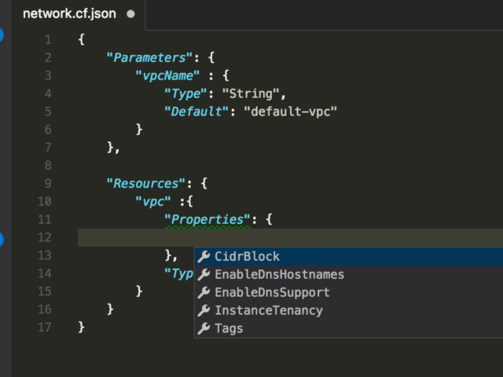
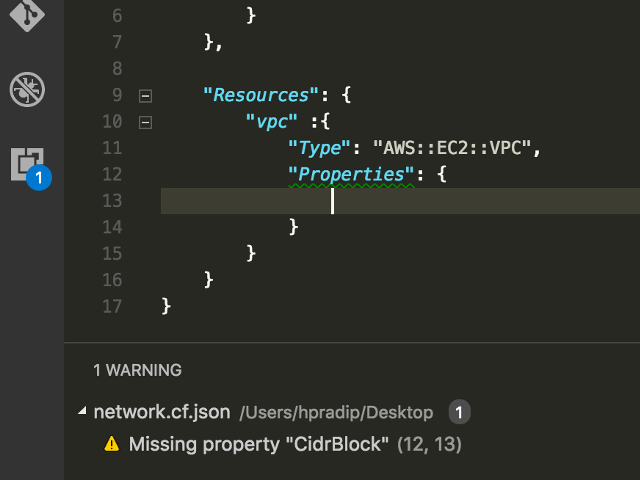
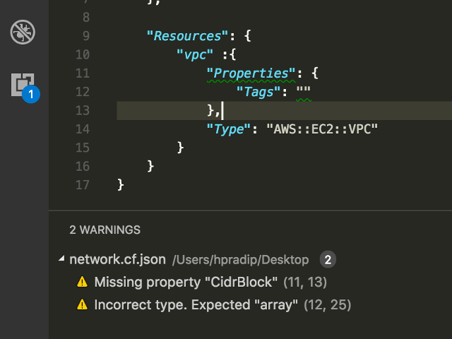

# Author templates for AWS CloudFormation

This extension help you author AWS CloudFormation templates with ease.

It uses JSON schema validation features of VSCode to validate your template files against a schema for AWS CloudFormation (currently uses [cloudformation-jsonschema](https://github.com/fungusakafungus/cloudformation-jsonschema))

## Capabilities

- Supports authoring of CloudFormation templates in JSON
- Supports validation of the JSON format by itself
- Highlights errors with a helpful error message (as a pop-up message visible on hover)
- Highlights errors when JSON is malformed
- Highlights missing attributes that are required at a minimum, such as:
  - a minimum of one resource per template
  - required 'Properties' for 'Resource' elements of a given 'Type'
- Prompts the choice of supported top-level elements (such as 'Parameters', 'Resources', etc.)
- Auto-completes known elements
- Auto-completes the structure of certain elements (such as 'Outputs', 'Resources', etc.)
- Prompts the choice of supported attributes for each element
  - for elements in 'Parameters'
  - for elements in 'Resources'
  - for elements in 'Outputs'
- Prompts the choice of supported 'Type' information
  - for 'Parameters'
  - for 'Resources'
- Currently relies upon a JSON schema for CloudFormation as published at [cloudformation-jsonschema](https://github.com/fungusakafungus/cloudformation-jsonschema)

## Illustration

1. Code completion

2. Template Validation

3. Type checking

## Requirements

This extension is active when working with templates with a filename ending in `.cf.json`

## Source

The source for this extension is maintained at Github repository [cf-plugin](git@github.com:krishnan-mani/cf-plugin.git)
